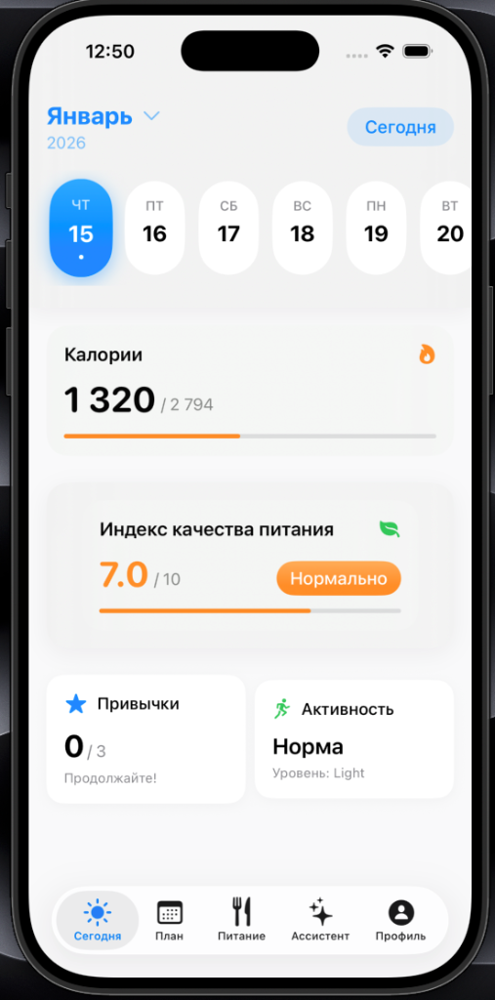
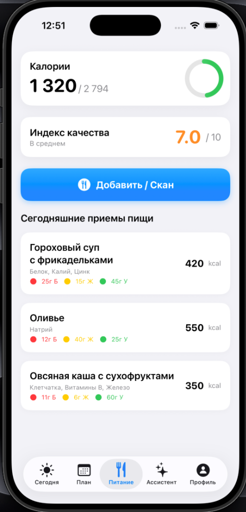
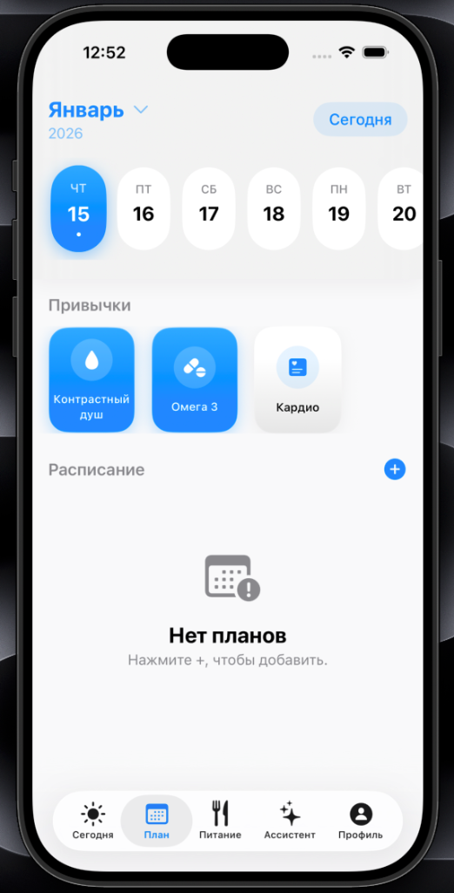
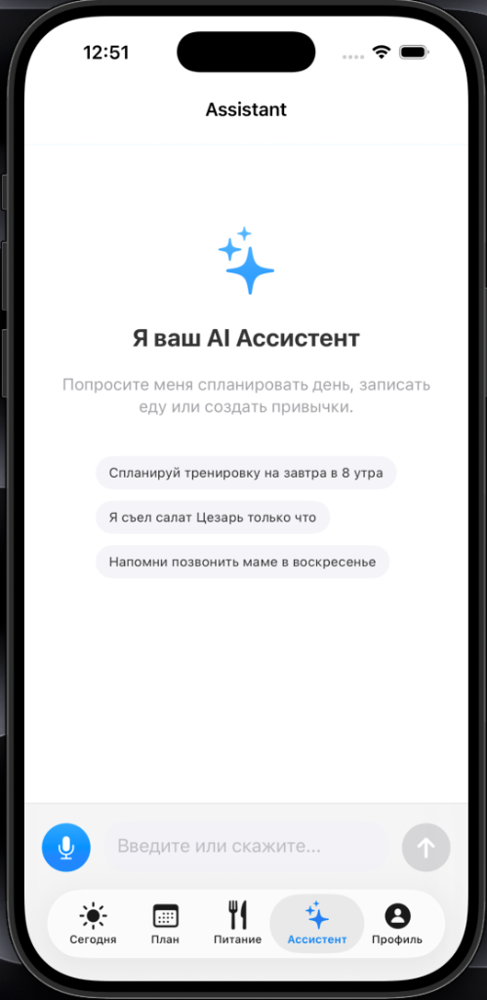
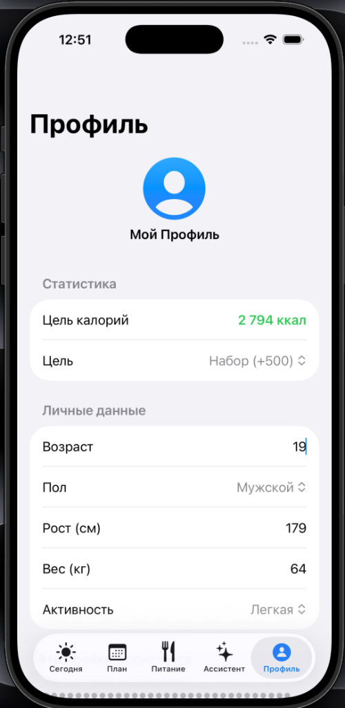

# xcodetime 🚀

**xcodetime** — это современное iOS-приложение для отслеживания здоровья и продуктивности, усиленное искусственным интеллектом (Gemini 2.0 Flash). Весь проект написан на SwiftUI с использованием SwiftData для молниеносной работы и хранения данных.

---

## ✨ Основные функции

### 1. 📋 Умный Дашборд
Обзор вашего дня в одном месте: калории, индекс качества питания, привычки и ближайшие задачи. Динамическая прокрутка дней и удобный календарь.

  

### 2. 🥗 Питание под контролем ИИ
Добавляйте еду простым описанием или через фото-сканер. Нейросеть автоматически определит:
- Название блюда и примерный вес.
- КБЖУ (Калории, Белки, Жиры, Углеводы).
- **Индекс качества питания (1-10)** — узнайте, насколько полезен ваш обед!
- Основные микронутриенты.

  

### 3. 📅 Интеллектуальное планирование
Управляйте задачами и привычками. Создавайте тренировки, события или ежедневные ритуалы (например, Контрастный душ или Омега-3) с удобной отметкой выполнения.

  

### 4. 🎙️ AI Ассистент (Оркестратор)
Голосовой помощник, который понимает контекст. Просто скажите: *"Запиши, что я съел Цезарь"* или *"Напомни потренить завтра в 8 утра"*, и ассистент сам создаст нужные записи.

  

### 5. 👤 Персонализация
Настройте свои параметры (рост, вес, активность), и приложение само рассчитает вашу дневную норму калорий.

  

---

## 🛠 Технологии
- **Язык**: Swift 5.10+
- **UI**: SwiftUI (Modern Design System)
- **База данных**: SwiftData (Local-first)
- **ИИ**: OpenRouter API (Gemini 2.0 Flash Lite)
- **Архитектура**: Service-Oriented + современный SwiftUI-state management

---

## 🚀 Как запустить
1. Склонируйте репозиторий.
2. Откройте `xcodetime.xcodeproj` в Xcode 15+.
3. В файле `Config.swift` укажите ваш **OpenRouter API Key**.
4. Соберите и запустите на симуляторе или устройстве (iOS 17.0+).

---

## 📄 Лицензия

© 2026 Георгий Клецков.

Данное программное обеспечение предоставляется для **ознакомительных и образовательных целей**. 

**Ограничения:**
- **Запрещено коммерческое использование**: Вы не имеете права продавать это приложение или использовать его код в платных продуктах без письменного разрешения автора.
- Разрешено использование в качестве портфолио, изучение кода и модификация для личных нужд.
